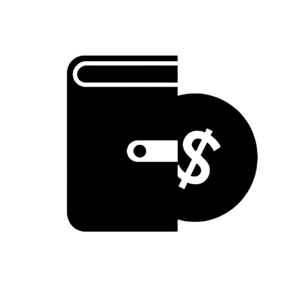

<p align="center">
  
</p>

<h1 align="center">🏛️ Baileo</h1>

<p align="center">
  <b>Tabungan on-chain tanpa potongan bulanan — di atas Celo Mainnet.</b>
</p>

Baileo terinspirasi dari **rumah adat Maluku** yang menjadi tempat berkumpul, bermusyawarah, dan menyimpan nilai kebersamaan. Dalam project ini, Baileo menjadi **tempat digital untuk menyimpan aset pengguna secara aman** di jaringan Celo Mainnet.

---

## 📌 Daftar Isi

- [Tentang Baileo](#-tentang-baileo)
- [Masalah](#-masalah)
- [Solusi](#-solusi)
- [Cara Kerja](#-cara-kerja)
- [Konsep Peg](#-konsep-peg)
- [Value Proposition](#-value-proposition)
- [Arsitektur](#-arsitektur)
- [Tech Stack](#-tech-stack)
- [Jaringan: Celo Mainnet](#-jaringan-celo-mainnet)
- [Roadmap](#-roadmap)
- [Disclaimer](#-disclaimer)
- [Lisensi](#-lisensi)

---

## 🏠 Tentang Baileo

**Baileo** adalah aplikasi tabungan berbasis blockchain **Celo** yang memungkinkan pengguna menyimpan aset **tanpa potongan bulanan**.

Pengguna menabung menggunakan **CELO**, lalu menerima token internal bernama **BAILEO** sebagai representasi saldo tabungan mereka. Token BAILEO menjadi **bukti kepemilikan saldo** yang dapat ditukar kembali menjadi CELO kapan saja.

---

## ❗ Masalah

Saat ini banyak orang menyimpan uang di bank, tetapi tetap terkena **potongan biaya administrasi setiap bulan** — walaupun tidak melakukan transaksi apa pun.

Akibatnya, **saldo terus berkurang secara perlahan** hanya karena biaya admin.

---

## ✅ Solusi

Baileo hadir sebagai tabungan on-chain yang:

- **Tidak ada biaya admin bulanan.**
- **Saldo transparan** di blockchain.
- **Bisa ditarik kapan saja.**
- Berjalan di **Celo Mainnet**.

Cocok untuk pengguna yang ingin menyimpan aset secara sederhana **tanpa kehilangan saldo karena potongan bank**.

---

## ⚙️ Cara Kerja

### 1. Tabung CELO

User menyetor CELO ke dalam smart contract Baileo dan menerima token BAILEO sesuai peg.

```
1 CELO  →  1000 BAILEO
```

Contoh:

```
User deposit 5 CELO
User menerima  5000 BAILEO
```

Token BAILEO ini menjadi bukti saldo tabungan user di dalam sistem.

### 2. Saldo Tersimpan di Baileo

CELO yang disetor user tersimpan di dalam smart contract Baileo. Sementara itu, user memegang token BAILEO sebagai representasi kepemilikan saldo.

```
User punya 5000 BAILEO  →  hak tarik 5 CELO
```

### 3. Tarik CELO

Saat user ingin menarik tabungan, user menukar (burn) kembali BAILEO menjadi CELO.

```
1000 BAILEO  →  1 CELO
```

Contoh:

```
User burn 1000 BAILEO
User menerima 1 CELO
```

---

## 🔄 Konsep Peg

Konsep inti Baileo sangat sederhana:

```
Deposit CELO    →  Dapat BAILEO
Withdraw BAILEO →  Dapat CELO

1 CELO  ⇄  1000 BAILEO
```

| Aksi         | Input        | Output       |
|--------------|--------------|--------------|
| **Deposit**  | 1 CELO       | 1000 BAILEO  |
| **Withdraw** | 1000 BAILEO  | 1 CELO       |

Smart contract dirancang **fully-collateralized**: jumlah CELO yang tersimpan di contract selalu cukup untuk menebus seluruh BAILEO yang beredar pada peg 1:1000.

---

## 💡 Value Proposition

Baileo adalah **tabungan on-chain tanpa potongan bulanan**.

- 🚫 **Tanpa biaya admin bulanan** — saldo tidak tergerus seiring waktu.
- 🔍 **Transparan** — seluruh saldo & transaksi tercatat di blockchain.
- ⏰ **Likuid** — tarik dana kapan saja.
- 🌱 **Celo Mainnet** — jaringan EVM yang murah dan ramah mobile.

> **Pitch singkat:** Baileo adalah aplikasi tabungan digital berbasis Celo Mainnet yang memungkinkan pengguna menyimpan CELO tanpa biaya admin bulanan. Tabung 1 CELO → dapat 1000 BAILEO sebagai representasi saldo. Tarik dana → tukar 1000 BAILEO kembali jadi 1 CELO. Aman, transparan, dan tidak tergerus potongan bulanan.

---

## 🏗️ Arsitektur

```
┌──────────────┐        deposit (CELO)        ┌────────────────────────┐
│              │ ───────────────────────────▶ │                        │
│     User     │                              │  Smart Contract Baileo │
│  (Wallet)    │ ◀─────────────────────────── │  - simpan CELO         │
│              │       mint 1000x BAILEO      │  - mint/burn BAILEO    │
└──────────────┘                              └────────────────────────┘
       │                                                  │
       │            withdraw (burn BAILEO)                │
       └──────────────────────────────────────────────────┘
                     terima kembali CELO
```

- **Vault** — menyimpan CELO yang disetor pengguna.
- **Token BAILEO** — token ERC-20 yang di-*mint* saat deposit dan di-*burn* saat withdraw.
- **Peg tetap** — 1 CELO = 1000 BAILEO (mint = `jumlahCELO × 1000`, withdraw = `jumlahBAILEO ÷ 1000`).

---

## 🧰 Tech Stack

| Layer          | Teknologi (rencana)                       |
|----------------|-------------------------------------------|
| Blockchain     | Celo Mainnet (EVM)                        |
| Smart Contract | Solidity `^0.8.x` + OpenZeppelin (ERC-20) |
| Token          | BAILEO (ERC-20)                           |
| Frontend       | React / Next.js                           |
| Wallet & RPC   | wagmi + viem (kompatibel EVM/Celo)        |
| Dev Tooling    | Hardhat / Foundry                         |

> Stack di atas adalah rencana implementasi. Sesuaikan dengan kebutuhan tim.

---

## 🌐 Jaringan: Celo Mainnet

| Parameter      | Nilai                    |
|----------------|--------------------------|
| Network        | Celo Mainnet             |
| Chain ID       | `42220`                  |
| Native Token   | CELO                     |
| RPC URL        | `https://forno.celo.org` |
| Block Explorer | `https://celoscan.io`    |

> Catatan: verifikasi ulang parameter jaringan dari dokumentasi resmi Celo sebelum deploy ke mainnet.

---

## 🗺️ Roadmap

- [ ] Smart contract Baileo (deposit / withdraw / peg 1:1000)
- [ ] Token BAILEO (ERC-20)
- [ ] Unit test & audit keamanan (reentrancy, rounding)
- [ ] Deploy ke Celo Testnet (Alfajores)
- [ ] Frontend (connect wallet, deposit, withdraw, lihat saldo)
- [ ] Deploy ke Celo Mainnet
- [ ] Verifikasi contract di Celoscan

---

## ⚠️ Disclaimer

Baileo masih dalam tahap pengembangan. Smart contract yang belum diaudit secara independen **tidak boleh** menyimpan dana riil. Gunakan dengan risiko sendiri. Tidak ada jaminan atas dana yang disimpan sampai contract teruji dan diaudit.

---

## 📄 Lisensi

Belum ditentukan. Disarankan menambahkan file `LICENSE` (mis. MIT) sebelum rilis publik.

---

<p align="center">
  <i>Baileo — menyimpan nilai bersama, tanpa potongan.</i> 🏛️
</p>
